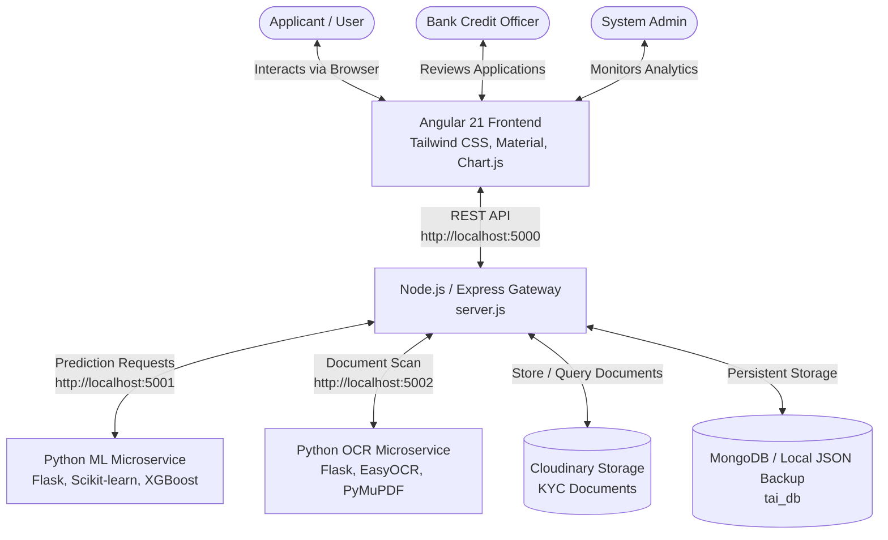

# Team Approval Intelligence (TAI)
### Intelligent AI/ML-Powered Loan Prediction & Underwriting Platform

[](https://angular.dev/)
[](https://nodejs.org/)
[](https://python.org/)
[](https://www.mongodb.com/)
[](https://tailwindcss.com/)

---

## 📌 Overview

**Team Approval Intelligence (TAI)** is an end-to-end intelligent loan underwriting, verification, and recommendation platform. It bridges the gap between traditional banking loan origination and modern automated underwriting by combining an **Angular 21** frontend, a **Node.js/Express** orchestration API, and **Python-based AI/ML & OCR microservices**.

The system automates:
- **Instant Eligibility Assessment**: Predicts loan approval probability and eligible loan amounts based on applicant demographic and financial metrics.
- **Personalized Bank Recommendation**: Recommends the optimal partner banks with the highest approval odds and tailored interest rates.
- **Automated KYC Document OCR**: Extracts key identity data from Aadhaar, PAN, Passbook, and Salary Slips to detect mismatches and prevent fraud.
- **Officer Decision Support System**: Provides bank credit officers with an in-depth risk score, automated feature extraction, and side-by-side document verification.
- **Executive Administration Dashboard**: Offers full visibility into bank performance, officer approval turnaround times, fraud detection logs, and user access management.

---

## 🏗️ System Architecture



---

## ✨ Key Features

### 👤 1. Applicant Experience (User Portal)
- **Instant Pre-Approval Screening**: Dynamic questionnaire assessing income, existing EMIs, education, marital status, and loan purpose.
- **Smart Bank Matchmaking**: Predicts eligibility across multiple financial institutions and suggests the best match.
- **Seamless Application & KYC Upload**: Drag-and-drop document upload with real-time file validation (Aadhaar, PAN, salary slip, bank statement).

### 🛡️ 2. Officer Verification Portal
- **Role-Based Authentication**: Secure officer login and session handling.
- **Queue Management**: Filter applications by status (`submitted`, `approved`, `rejected`, `fraud_suspect`).
- **AI-Powered Risk Analysis**: Deep risk scoring with feature impact weights to assist officer decisions.
- **OCR Side-by-Side Audit**: Visual comparison between applicant-provided details and text extracted by OCR from uploaded KYC documents.
- **One-Click Approval / Rejection**: Instant workflow transition with audit timestamps.

### 📊 3. Executive Admin Portal
- **Performance Analytics**: Visual breakdowns of loan volume, approval ratios, and portfolio risk distributions via Chart.js.
- **Bank-Wise Insights**: Track application disbursement velocity and success metrics across partner banks.
- **Fraud & Anomaly Detection**: Flag mismatched document credentials, blacklisted identifiers, and suspicious submission patterns.
- **User Management**: Block or unblock users exhibiting fraudulent activity.

---

## 🛠️ Technology Stack

| Layer | Technologies |
|---|---|
| **Frontend** | Angular 21, TypeScript, Tailwind CSS, Angular Material, RxJS, Chart.js, Three.js |
| **Backend API Gateway** | Node.js (v20+), Express.js, Multer, Mongoose, Cloudinary SDK, CORS |
| **Machine Learning Service** | Python 3, Flask, Scikit-learn, XGBoost, Pandas, NumPy, Joblib |
| **OCR Document Scanner** | Python 3, Flask, EasyOCR, PyMuPDF (fitz), Pillow |
| **Storage & Database** | MongoDB (Primary) / Fallback Local JSON (`local_applications.json`), Cloudinary |

---

## 📁 Repository Structure

```text
Team-Approval-Intelligence/
├── Backend/
│   ├── Models/
│   │   ├── ML model/              # Trained pickle models (user approval, bank recommender)
│   │   └── officer models/         # Officer risk prediction models & scripts
│   ├── uploads/                   # Local uploads directory for temporary processing
│   ├── .env.example               # Template for environment configuration
│   ├── local_applications.json    # Offline local JSON database fallback
│   ├── ml_service.py              # Flask microservice for ML predictions (Port 5001)
│   ├── ocr_service.py             # Flask microservice for document OCR (Port 5002)
│   ├── package.json               # Node.js backend dependencies
│   ├── requirements.txt           # Python dependencies for ML and OCR services
│   └── server.js                  # Main Express API server (Port 5000)
├── Frontend/
│   ├── src/
│   │   ├── app/
│   │   │   ├── core/              # Services, guards, interceptors, and models
│   │   │   ├── features/          # Feature components
│   │   │   │   ├── admin/         # Admin Login and Dashboard
│   │   │   │   ├── landing/       # Responsive Landing Page
│   │   │   │   ├── officer/       # Officer Login, Dashboard, and Review
│   │   │   │   └── user/          # User Eligibility, Results, and Application Form
│   │   │   ├── app.routes.ts      # Application routing
│   │   │   └── app.ts             # Root application component
│   │   ├── assets/                # Static assets, branding, and images
│   │   ├── styles.scss            # Global styles and Tailwind directives
│   │   └── main.ts                # Application entry point
│   ├── angular.json               # Angular workspace configuration
│   ├── package.json               # Frontend dependencies & scripts
│   └── tailwind.config.js         # Tailwind CSS styling configuration
├── Loan Prediction Using Machine Learning (1).docx  # Project specification & documentation
├── TEAM_GUIDE.md                  # Team collaboration & git contribution guidelines
└── README.md                      # Project documentation
```

---

## 🚀 Getting Started

### Prerequisites
Make sure you have the following installed on your machine:
- **Node.js**: v18.x or higher (recommended v20+)
- **npm**: v9.x or higher
- **Python**: v3.9 - v3.12 with `pip`
- **MongoDB**: (Optional) Local MongoDB instance or MongoDB Atlas URI (falls back to local JSON store if unavailable)

---

### Step 1: Clone the Repository
```bash
git clone https://github.com/chitturijairevanthdev-gif/Team-Approval-Intelligence.git
cd Team-Approval-Intelligence
```

---

### Step 2: Configure Environment Variables
Inside the `Backend` directory, create a `.env` file based on `.env.example`:

```bash
cd Backend
cp .env.example .env
```

Edit `Backend/.env`:
```env
STORAGE_MODE=local_json

# MongoDB (Optional - falls back to offline JSON if not connected)
MONGODB_URI=mongodb://localhost:27017/tai_db

# Cloudinary (Required for live document upload/storage)
CLOUDINARY_CLOUD_NAME=your_cloud_name
CLOUDINARY_API_KEY=your_api_key
CLOUDINARY_API_SECRET=your_api_secret
```

---

### Step 3: Run the Backend Services

#### A. Start the Express API Gateway
```bash
cd Backend
npm install
npm start
```
> The API Gateway will start on **`http://localhost:5000`**.

#### B. Start the Python AI/ML Microservice
In a new terminal window:
```bash
cd Backend
python -m venv venv
# On Windows:
.\venv\Scripts\activate
# On Linux/macOS:
source venv/bin/activate

pip install -r requirements.txt
python ml_service.py
```
> The ML Service runs on **`http://localhost:5001`**.

#### C. Start the Python OCR Microservice
In a third terminal window:
```bash
cd Backend
# Activate virtual environment
.\venv\Scripts\activate

python ocr_service.py
```
> The OCR Service runs on **`http://localhost:5002`**.

---

### Step 4: Run the Frontend (Angular)
In another terminal window:
```bash
cd Frontend
npm install
npm start
```
> The web application will launch at **`http://localhost:4200`**.

---

## 🔌 API Reference Summary

### Core Gateway (`http://localhost:5000`)
| Method | Endpoint | Description |
|---|---|---|
| `GET` | `/health` | Server status and connectivity health check |
| `POST` | `/predict` | Proxies user eligibility prediction to ML service |
| `POST` | `/officer_predict` | Proxies officer comprehensive risk scoring |
| `POST` | `/scan-documents` | Uploads KYC files to Cloudinary and runs OCR extraction |
| `POST` | `/submit-application` | Full multipart application submission with KYC documents |
| `GET` | `/applications` | Retrieves loan applications (supports filtering) |
| `GET` | `/application/:id` | Retrieves a single application by ID |
| `POST` | `/update_status` | Officer update (approve / reject / flag application) |
| `POST` | `/admin/login` | Admin credentials verification |
| `GET` | `/admin/stats` | System overview stats & status counts |
| `GET` | `/admin/bank-stats` | Bank-wise application distribution |
| `GET` | `/admin/officer-stats`| Officer review activity metrics |
| `GET` | `/admin/fraud-cases` | Flagged fraud / suspicious applications |
| `POST` | `/admin/block-user` | Blacklists/blocks user identity |

### ML Microservice (`http://localhost:5001`)
| Method | Endpoint | Description |
|---|---|---|
| `GET` | `/health` | Model loading status check |
| `POST` | `/predict` | User loan eligibility and bank recommendation |
| `POST` | `/officer_predict` | Detailed credit risk scoring for officers |

### OCR Microservice (`http://localhost:5002`)
| Method | Endpoint | Description |
|---|---|---|
| `GET` | `/health` | EasyOCR model status |
| `POST` | `/scan` | Extracts text and structured entities from uploaded document images/PDFs |

---

## 👥 Contributors & Collaboration
For team contribution conventions, branch management, and git workflows, please refer to [`TEAM_GUIDE.md`](./TEAM_GUIDE.md).

---

## 📄 License
This project is developed for educational and research purposes under the academic project guidelines.
